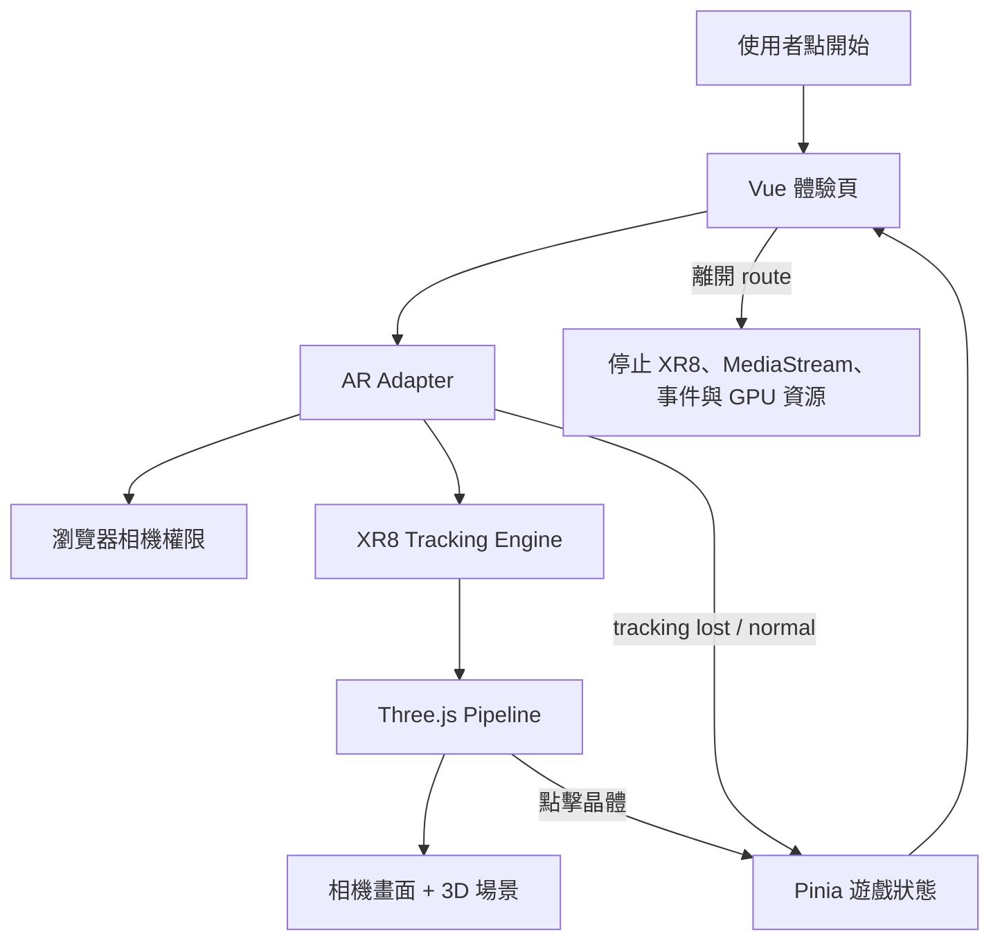

# WebAR POC Starter Guide

> 如果你想先理解相機、空間掃描、圖片偵測、anchor 與 teardown 等不隨遊戲改變的部分，請先閱讀 [WebAR 核心概念](WEBAR-CORE-CONCEPTS.md)。本文件再說明如何把核心套用成可客製的 POC。

這份文件的目的不是教你背 8th Wall API，而是讓你知道：

1. 一個 WebAR POC 最少需要哪些零件。
2. 哪些程式碼是相機／AR 核心，通常應該保留。
3. 哪些是客製內容，可以放心替換。
4. 建立下一個專案時，哪些檔案值得複製。

目前專案使用 JavaScript、Nuxt 4、Vue 3、Pinia、Three.js 和 8th Wall World Tracking。

## 先建立一個心智模型

把 WebAR 想成五層，不要把所有東西都寫在同一個 Vue component：

| 層級 | 目前檔案 | 負責什麼 | 客製時通常怎麼做 |
| --- | --- | --- | --- |
| 入口 UI | `pages/experiences/spatial-hunt.vue` | 按鈕、提示、HUD、手勢 | 大量修改 |
| 遊戲流程 | `stores/spatialHunt.js` | phase、計時、收集、暫停 | 規則不同才修改 |
| AR adapter | `services/ar/8thWallWorldAdapter.client.js` | 載入 XR8、開相機、tracking、停止相機 | 同引擎盡量保留 |
| 3D scene | `services/ar/createSpatialHuntPipeline.client.js` | GLB、燈光、raycasting、動畫 | 大量修改 |
| 客製設定 | `experiences/spatial-hunt/config.js` | 模型、數量、距離、尺寸 | 優先從這裡修改 |



最重要的分界是：

- Adapter 不知道遊戲規則。
- Three.js scene 不決定顯示哪個 Vue 畫面。
- Pinia 不直接操作 XR8 或 Three.js object。
- Vue 頁面負責協調，但不實作底層 tracking。

## 一個 WebAR POC 一定要有什麼

### 1. HTTPS

正式手機環境必須透過 HTTPS，否則瀏覽器不會提供相機。`localhost` 是開發階段的特殊例外。

### 2. 使用者觸發的開始動作

不要一進頁面就直接要求相機。使用者點擊「開啟相機」後再執行：

```js
await adapter.load()
const compatibility = adapter.checkCompatibility()
await adapter.start(canvas, pipelineModules)
```

這段協調程式目前位於 `startExperience()`。

### 3. 顯示相機畫面的 canvas

```html
<canvas ref="canvas" />
```

XR engine 將相機影像畫到 canvas，Three.js 再把模型畫在相同畫面上。

### 4. Tracking engine

瀏覽器的 `getUserMedia()` 只會給你相機影片，不會自動知道地面、圖片或物件的位置。你仍然需要一個 tracking engine：

- World Tracking：目前使用 8th Wall SLAM binary。
- Image Tracking：可使用 MindAR 或 8th Wall Image Targets。
- Face Tracking：可使用 MindAR Face 或 8th Wall Face Effects。

換追蹤類型時，通常是替換 adapter，而不是重寫首頁與所有 UI。

### 5. 3D scene 與 render loop

Tracking engine 回傳相機姿態或 target anchor；Three.js 責責：

- 建立 scene、camera、light。
- 載入 GLB。
- 每幀更新模型。
- 將螢幕點擊轉成 raycasting。
- 播放動畫。

### 6. 完整 teardown

這不是選配。離開頁面時至少要：

```js
pipeline.dispose()
await adapter.stop()
```

目前 `cleanupRuntime()` 還會避免 Vue 的多個 lifecycle 重複清理。缺少 teardown 常見結果是：返回首頁後相機燈仍亮、第二次進入 AR 畫面黑屏，或 GPU 記憶體持續增加。

## 核心程式碼與替換地圖

### 建議保留：8th Wall adapter

[8thWallWorldAdapter.client.js](../services/ar/8thWallWorldAdapter.client.js) 是目前最接近「基底」的檔案。

它負責：

- 固定版本 vendor scripts。
- 等待 `XR8`、`XRExtras`、`LandingPage` globals。
- HTTPS、相機 API 與裝置相容性檢查。
- pipeline module 安裝順序。
- tracking status 訂閱。
- pause、resume、recenter。
- 停止 XR8、MediaStream tracks 與事件。

如果新專案仍然是 8th Wall World Tracking，可以整份複製；通常不需要修改內部程式。

如果新專案改用 MindAR Image Tracking，則不要硬套這個 adapter。新建 `MindArImageAdapter.client.js`，但維持相似的 `load/start/stop` lifecycle 即可。

### 優先替換：POC config

[config.js](../experiences/spatial-hunt/config.js) 是第一個客製入口：

```js
export const spatialHuntConfig = {
  modelPath: 'models/toy-car.glb',
  targetCount: 5,
  spawn: {
    minRadiusMeters: 0.8,
    maxRadiusMeters: 1.5,
  },
  rover: {
    modelSizeMeters: 0.64,
  },
}
```

常見修改：

| 想修改的內容 | 修改位置 |
| --- | --- |
| 換 GLB | `config.js` 的 `modelPath`，並把模型放進 `public/models/` |
| 晶體數量 | `config.js` 的 `targetCount` |
| 搜尋距離／高度 | `config.js` 的 `spawn` |
| 車體大小／縮放限制 | `config.js` 的 `rover` |
| 標題、說明、按鈕 | `spatial-hunt.vue` 的 template |
| 晶體造型、顏色、粒子 | `createSpatialHuntPipeline.client.js` 的 `createCrystal()` |
| 點擊後的遊戲規則 | pipeline 的 `onCollect` 與 store 的 `collect()` |
| 整個 AR 引擎 | 替換 adapter |

### 通常需要改：Three.js pipeline

[createSpatialHuntPipeline.client.js](../services/ar/createSpatialHuntPipeline.client.js) 是每個客製案最常修改的地方。

你可以把它理解成「沒有 Vue template 的 3D component」：

- `onStart()` 類似 Vue 的 `onMounted()`：建立一次場景。
- `onUpdate()` 類似 animation loop：每一幀更新。
- `dispose()` 類似 `onBeforeUnmount()`：釋放資源。
- 回傳的公開 methods 類似 component exposed methods。

例如新的商品 POC 不需要晶體，可以刪掉 `createCrystal()` 和 `collectAtScreen()`，保留模型載入、raycaster 與 dispose 的結構。

### 視需求保留：Pinia store

如果只是「掃到圖片 → 顯示模型 → 點一下旋轉」，不一定需要 Pinia，Vue `ref()` 就夠了。

以下情況再使用 store：

- 多個 UI component 需要同一狀態。
- 有明確 phase 流程。
- 有計分、計時、重玩或 localStorage。
- 場景事件需要更新 Vue HUD。

## 建立新的 World Tracking 專案

如果新專案同樣是把物件放進空間，最小複製清單是：

```text
package.json
nuxt.config.js
assets/css/main.css                 # 可換成自己的設計
pages/experiences/my-poc.vue        # 從 spatial-hunt.vue 精簡
services/ar/8thWallWorldAdapter.client.js
services/ar/createMyPocPipeline.client.js
experiences/my-poc/config.js
public/models/my-model.glb
public/legal/8TH-WALL-NOTICE.txt
```

實作順序：

1. 複製 adapter，不先修改。
2. 建立 `createMyPocPipeline.client.js`。
3. pipeline 先只畫一個 `BoxGeometry`，確認 tracking 正常。
4. 再載入真正 GLB。
5. 最後加入點擊與遊戲規則。
6. 頁面離開時一定呼叫 `dispose()` 和 `stop()`。

不要複製：

```text
node_modules/
.nuxt/
.output/
.vercel/
.env
```

## 建立 Image Tracking POC

圖片偵測和目前 World Tracking 最大差異不是 UI，而是模型的 anchor：

| World Tracking | Image Tracking |
| --- | --- |
| 玩家點擊地面建立 `worldRoot` | 引擎偵測圖片後提供 `imageAnchor` |
| 模型留在房間座標 | 模型跟著圖片移動 |
| tracking status 是 NORMAL／LIMITED | tracking event 是 found／updated／lost |
| 不需要 target 圖檔 | 需要圖片和預處理後的 target 資料 |

建議最小目錄：

```text
pages/experiences/image-scan.vue
experiences/image-scan/config.js
experiences/image-scan/useImageScan.js
experiences/image-scan/createScene.js
public/targets/image-scan/target.jpg
public/targets/image-scan/targets.mind
public/models/image-scan-model.glb
```

Image Tracking POC 的最小狀態只有：

```js
const phase = ref('intro')
// intro | loading | scanning | found | error
```

事件資料流：

```text
點開相機
→ 載入 target data
→ scanning
→ target found
→ 顯示 anchor 與模型
→ 點模型執行 handleModelTap()
→ target lost 時隱藏模型
→ 離開頁面停止相機
```

第一版建議把所有客製互動集中在一個函式：

```js
const handleModelTap = () => {
  // 客製案主要替換區：播放動畫、換材質、顯示資訊或切換模型。
  scene.toggleModelAnimation()
}
```

不要一開始設計 JSON action schema。客戶需要不同互動時，直接替換這個函式通常更清楚。

## 首頁如何保持簡單

首頁只讀取 [experiences.js](../data/experiences.js)：

```js
{
  id: 'image-scan',
  title: '圖片掃描',
  route: '/experiences/image-scan',
  status: 'ready',
}
```

首頁不知道 POC 使用哪個 tracking engine，也不載入 Three.js。這樣增加 POC 不會讓首頁變複雜。

## 什麼時候才抽 shared

同一段程式至少在兩個完成的 POC 中重複，而且行為真的相同，再移到 `shared`。

適合抽共用：

- 相機權限與不支援提示。
- GLB 載入及 dispose helper。
- FPS debug panel。
- QR code。
- safe-area UI shell。

先不要抽共用：

- 模型點擊後做什麼。
- 動畫 timeline。
- 客戶文案與流程。
- target found 後的商業邏輯。
- 所有引擎都必須遵守的巨大 adapter interface。

## 常見問題

### 為什麼不能只用 Three.js 開相機？

Three.js 是 3D renderer，不是 tracking engine。它可以顯示相機影片與模型，但不知道模型應該固定在房間或圖片的哪個位置。

### 為什麼需要 adapter？

它把 vendor API 限制在一個檔案裡。將來換引擎時，Vue UI 與遊戲規則不會到處出現 `XR8`、`MindARThree` 等 globals。

### 每個 POC 都需要 Pinia 嗎？

不需要。只有狀態跨 component 或有複雜 phase 時才使用。

### 每個 POC 都需要後端嗎？

不需要。模型、target、文案都固定時，GitHub Pages 靜態部署就足夠。需要上傳素材、客戶帳號、成效統計或 CMS 時才增加後端。

### 為什麼模型放在 `public/`？

GLB 和 target data 不需要 Vite 編譯，可直接以 URL 讓 Three.js 或 tracking engine下載。動態組合 URL 時記得加上 `runtimeConfig.app.baseURL`，否則 GitHub Pages 的 `/webar-lab/` 子路徑會 404。

## 建議的原始碼閱讀練習

1. 在 `config.js` 把 `targetCount` 改成 3，執行測試並觀察畫面。
2. 在 `createCrystal()` 改變 `color` 和 `emissive`。
3. 在 `handleModelTap` 或 `onCollect` 加入一個 Vue 訊息。
4. 暫時註解 `adapter.stop()`，觀察相機為什麼不會關閉，再立刻還原。
5. 用 BoxGeometry 取代 GLB，理解 tracking 與素材載入其實是兩件事。

## 最後的判斷方式

當你建立新 WebAR POC 時，先問五個問題：

1. 我要追蹤的是空間、圖片、臉，還是位置？
2. 哪個 adapter 負責開相機與回傳 tracking？
3. 模型要掛在哪個 anchor？
4. 使用者點模型後要執行什麼？
5. 離開頁面時有哪些資源必須停止？

這五個答案清楚後，通常還不需要平台、CMS 或後端。
