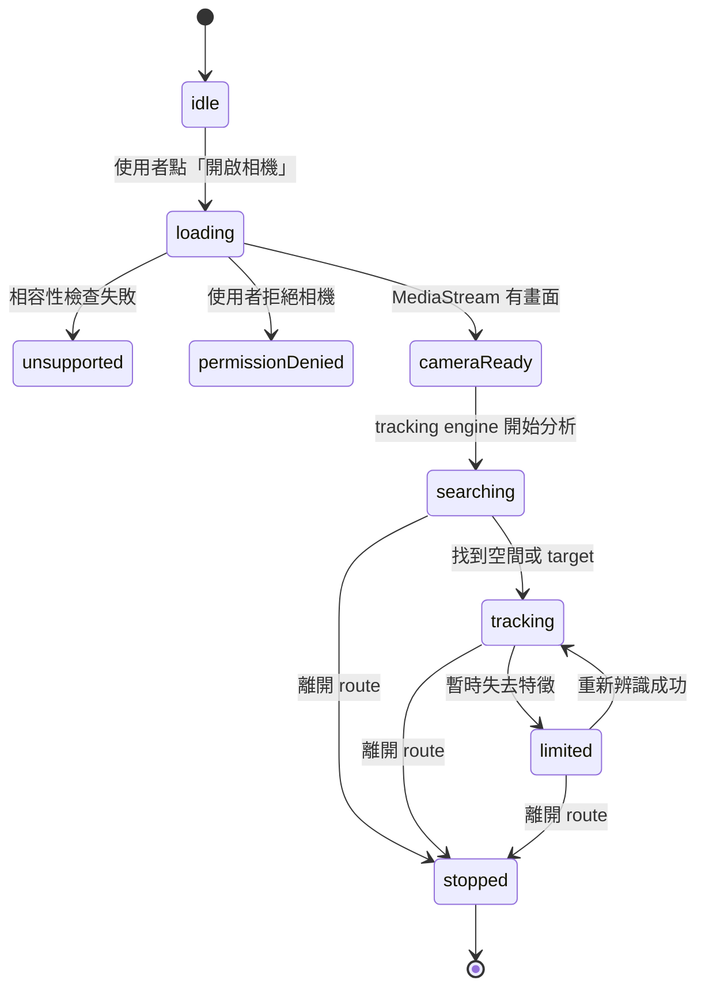

# WebAR 核心概念：所有 POC 都會用到的骨架

這份文件先不談尋寶規則。目標是理解：無論最後做空間擺放、圖片辨識、臉部濾鏡或商品展示，一個 WebAR session 都必須處理哪些事情。

## 最重要的一句話

WebAR 不是「打開相機後放一個 Three.js 模型」。完整資料流是：

```text
安全的 HTTPS 頁面
→ 使用者允許相機
→ tracking engine 分析每一幀
→ engine 回傳 camera pose 或 target anchor
→ Three.js 依 anchor 畫出模型
→ 使用者互動
→ 頁面離開時停止所有資源
```

其中相機、tracking 和 3D rendering 是三件不同的事。

## 不同專案都不會消失的六個核心

| 核心 | 解決的問題 | 目前程式位置 |
| --- | --- | --- |
| Secure Context | 瀏覽器是否允許相機 | adapter 的 `checkCompatibility()` |
| Camera lifecycle | 何時要求權限、暫停與關閉 | adapter 的 `start/pause/resume/stop` |
| Tracking engine | 從影像算出空間、圖片或臉的位置 | 8th Wall XR8；未來也可能是 MindAR |
| Coordinate / Anchor | 模型究竟要跟著哪個座標 | Three.js pipeline 的 `worldRoot` 或未來的 image anchor |
| Render / Interaction | 畫模型、動畫和點擊偵測 | Three.js pipeline |
| Teardown | 離開後確實關相機和釋放 GPU | 頁面的 `cleanupRuntime()` |

遊戲 store、計時、晶體、分數和 HUD 都不是 WebAR 核心，可以完全移除。

## 核心生命週期



不同 POC 只是改變 `searching → tracking` 的判斷：

- World Tracking：SLAM 建立足夠的環境特徵並穩定追蹤相機。
- Image Tracking：辨識到指定 target image。
- Face Tracking：偵測到臉與 landmarks。

## 1. Secure Context：為什麼一定要 HTTPS

瀏覽器只在安全環境提供 `navigator.mediaDevices.getUserMedia()`：

- Production：必須是 HTTPS。
- 本機開發：`localhost` 和 `127.0.0.1` 是特殊例外。
- 手機開 `http://192.168.x.x`：通常不算安全環境。

最小檢查：

```js
if (!window.isSecureContext) {
  throw new Error('WebAR 需要 HTTPS')
}

if (!navigator.mediaDevices?.getUserMedia) {
  throw new Error('瀏覽器不支援相機 API')
}
```

目前位於 [8thWallWorldAdapter.client.js](../services/ar/8thWallWorldAdapter.client.js) 的 `checkCompatibility()`。

## 2. Camera lifecycle：相機不只是 start

所有 WebAR 都需要處理：

1. 使用者點擊後才要求權限。
2. 等待相機真正產生 video frame。
3. 拒絕權限時顯示可理解的錯誤。
4. 切到背景時 pause。
5. 回到前景時 resume。
6. 離開頁面時 stop 每一條 MediaStream track。

### 不要同時開兩次相機

如果 8th Wall 或 MindAR 已經負責 `getUserMedia()`，Vue 頁面不應該再自己呼叫一次。否則可能產生：

- 兩份 MediaStream 競爭鏡頭。
- iOS 第二次進頁面黑屏。
- teardown 時只關掉其中一份 stream。

所以目前頁面只呼叫：

```js
await adapter.start(canvas, pipelineModules)
```

實際相機細節封裝在 adapter。

## 3. Tracking engine：相機本身不會定位

相機只提供連續圖片。Tracking engine 才會從圖片計算「模型要放在哪裡」。

### World Tracking／空間掃描

SLAM 會在每一幀尋找環境特徵，估計手機的 6DoF camera pose：

```text
position: x, y, z
rotation: quaternion
```

當手機移動時，虛擬物件看起來才能留在原本的房間位置。

「請掃描環境」只是引導使用者讓 SLAM 收集更多特徵，不是一個獨立的相機 API。適合掃描的環境通常具有明暗、邊緣和紋理；純白牆面很難提供足夠特徵。

### 目前 POC 的重要限制

目前尋寶 POC 沒有真正執行 plane detection。它的放置方式是：

1. SLAM 負責穩定世界座標。
2. Three.js 在 `y = 0` 建立透明虛擬平面。
3. 使用者點畫面時，raycaster 與這張平面求交點。

因此「環境已掃描」按鈕目前是 UX coaching，不代表引擎真的辨識出地板。若專案需要桌面高度、牆面或真正 hit-test，必須使用引擎提供的 plane／surface 資料，不能只沿用這張透明平面。

### Image Tracking／圖片偵測

Image Tracking 不是理解圖片內容，而是比對預先登錄的視覺特徵：

```text
target.jpg
→ 預處理／編譯特徵
→ target data（例如 targets.mind 或 8th Wall metadata）
→ 相機每幀比對
→ found / updated / lost
```

辨識成功後，engine 會提供圖片的 position、rotation 和 scale。模型掛在這個 image anchor 底下，就會跟著圖片移動。

```text
imageAnchor
└─ model
```

你不需要空間尋寶的 `worldRoot`、地面點擊和 recenter；要替換的是 tracking adapter 與 anchor 更新方式。

### Face Tracking

Face engine 通常回傳 landmarks 或特定 anchor，例如鼻樑、眼睛、頭部姿態：

```text
faceAnchor
├─ glasses
└─ hat
```

相機 lifecycle、render loop 和 teardown 仍然相同；差別只有 tracking output 與 anchor。

## 4. Coordinate / Anchor：所有 AR 的真正核心

模型不是直接「放到相機畫面」，而是掛在某個座標節點下面。

| POC | Anchor 從哪裡來 | 模型怎麼移動 |
| --- | --- | --- |
| 空間放置 | SLAM world coordinate + 使用者點擊位置 | 留在房間中 |
| 圖片偵測 | target image pose | 跟著圖片 |
| 臉部濾鏡 | face landmark／head pose | 跟著臉 |
| GPS AR | 經緯度轉換後的 local coordinate | 跟著地理位置 |

建立新 POC 時，先回答「我的模型要掛在哪個 anchor？」通常比先挑 UI library 更重要。

## 5. Render loop 與互動

Tracking engine 與 Three.js 通常共享同一個逐幀循環：

```js
const module = {
  onStart() {
    // 建立 scene、light、model、anchor。
  },
  onUpdate(frame) {
    // 讀取 tracking 結果、更新 anchor、播放動畫。
  },
  onRemove() {
    // dispose Three.js 資源。
  },
}
```

使用者點擊模型則是另一條流程：

```text
pointer event
→ 螢幕座標轉成 -1～1
→ Raycaster 從 camera 發射射線
→ 找到被點擊的 Three.js mesh
→ 執行客製行為
```

Raycasting 可以跨 POC 重用；點到模型後要做什麼則屬於客製程式。

## 6. Teardown：最容易被忽略的核心

Nuxt route 切換不會自動幫 XR engine 關相機。所有 POC 都應保留這種結構：

```js
const cleanupRuntime = async () => {
  unsubscribeTracking?.()
  pipeline?.dispose()
  await adapter?.stop()
}

onBeforeRouteLeave(cleanupRuntime)
onBeforeUnmount(cleanupRuntime)
```

Adapter 的 `stop()` 還必須處理：

```js
mediaStream?.getTracks().forEach((track) => track.stop())
```

Three.js 的 `dispose()` 則要處理 geometry、material 和 texture。只呼叫 `scene.remove()` 不會釋放 GPU 資源。

## 核心與非核心的界線

### 每個 WebAR 都需要

- HTTPS 與 browser compatibility。
- 相機 permission、start、pause、resume、stop。
- 某種 tracking engine。
- Tracking output 對應到 Three.js anchor。
- Render loop。
- Error／unsupported UI。
- Route teardown。

### 視 POC 決定

- GLB 或純 Three.js geometry。
- 點擊、縮放、拖曳、動畫。
- Pinia。
- 計分與計時。
- QR code。
- localStorage。
- 後端、API、帳號、CMS。

## 最小的通用 adapter 概念

不同引擎不需要勉強共用所有 API，但可以維持相同 lifecycle：

```js
const adapter = {
  async load() {},
  checkCompatibility() {},
  async start(canvas, sceneModule) {},
  subscribeTracking(handler) {},
  pause() {},
  resume() {},
  async stop() {},
}
```

以下能力則應該是特定模式的選配：

```js
adapter.recenter?.()       // World Tracking
adapter.setTarget?.(data)  // Image Tracking
adapter.switchCamera?.()   // Face／自拍體驗
```

這比建立一個包含所有 AR 功能的巨大介面更容易維護。

## 建立新專案時真正要複製什麼

### 如果仍使用 8th Wall World Tracking

核心複製：

```text
services/ar/8thWallWorldAdapter.client.js
pages/experiences/spatial-hunt.vue 裡的 startExperience／cleanupRuntime lifecycle
services/ar/createSpatialHuntPipeline.client.js 的 module／dispose 骨架
public/legal/8TH-WALL-NOTICE.txt
```

不要直接複製遊戲：

```text
stores/spatialHunt.js
utils/spawnLayout.js
晶體、計時、最佳成績
```

除非新 POC 真的也需要這些規則。

### 如果改做 Image Tracking

概念上保留：

- Vue 的開始、錯誤與 teardown 流程。
- Adapter lifecycle 的形狀。
- Three.js scene／raycasting／dispose 方法。

需要替換：

- `8thWallWorldAdapter` → `MindArImageAdapter` 或 Image Target adapter。
- `worldRoot` → `imageAnchor`。
- `NORMAL/LIMITED` → `found/updated/lost`。
- 地面點擊 → target data 載入。

## 閱讀目前程式的核心順序

1. [startExperience() 與 cleanupRuntime()](../pages/experiences/spatial-hunt.vue)：看一次 AR session 如何開始與結束。
2. [8thWallWorldAdapter](../services/ar/8thWallWorldAdapter.client.js)：看相機與 tracking engine 如何被封裝。
3. [createSpatialHuntPipeline](../services/ar/createSpatialHuntPipeline.client.js)：只先看 `module`、`placeAtScreen()` 和 `dispose()`。
4. [POC config](../experiences/spatial-hunt/config.js)：看客製參數如何與核心分離。
5. 最後才看 [spatialHunt store](../stores/spatialHunt.js)：這是遊戲，不是 AR 的必要部分。

## 你可以用這五題檢查任何 WebAR 專案

1. 誰負責呼叫或管理 `getUserMedia()`？
2. Tracking engine 每幀回傳什麼資料？
3. Three.js 模型掛在哪個 anchor？
4. Route 離開時誰停止相機並 dispose GPU？
5. 哪些是 tracking 核心，哪些只是這次客製互動？

如果這五題都能從幾個清楚的檔案中找到答案，這個 POC 就具備可複製、可客製的基底。
